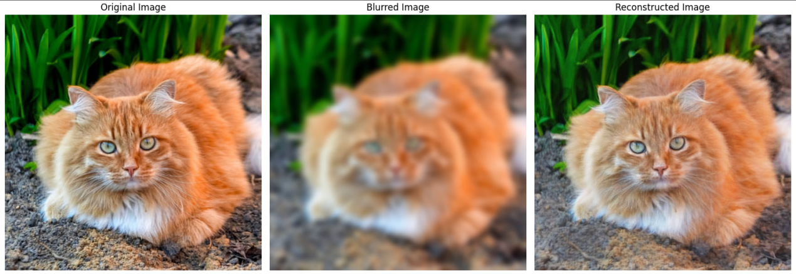

# Image Deblurring Network

A deep learning project that implements a Convolutional Neural Network (CNN) for image deblurring using PyTorch. This network is designed to remove Gaussian blur from images and reconstruct sharp, clear images using a combination of pixel-wise and perceptual losses.



## Project Overview

This project demonstrates a simple yet effective approach to image deblurring using deep learning. The network learns to map blurred images back to their sharp counterparts through supervised learning on a single image (overfitting approach). While this is primarily designed for educational purposes and proof-of-concept, it showcases important techniques in computer vision including:

- Residual connections for preserving image details
- Mixed precision training for efficient GPU utilization
- Perceptual loss using pre-trained VGG19 features
- Proper gradient clipping and regularization

## Model Architecture

### Network Design
The `DeblurNet` is a CNN with residual/skip connections that preserves the original image information while learning to reconstruct sharp details.

**Architecture Flow:**
```
Input (3 channels) → Conv2d(64) → Tanh → Conv2d(128) → Tanh → Conv2d(256) → Tanh → 
Conv2d(256) → Tanh → Conv2d(128) → Tanh → Conv2d(64) → Tanh → Conv2d(3) → 
Add Residual Connection → Sigmoid → Output (3 channels)
```

**Layer Details:**
- **Layer 1**: Conv2d(3→64, kernel=3×3, padding=1) + Tanh
- **Layer 2**: Conv2d(64→128, kernel=3×3, padding=1) + Tanh  
- **Layer 3**: Conv2d(128→256, kernel=3×3, padding=1) + Tanh
- **Layer 4**: Conv2d(256→256, kernel=3×3, padding=1) + Tanh
- **Layer 5**: Conv2d(256→128, kernel=3×3, padding=1) + Tanh
- **Layer 6**: Conv2d(128→64, kernel=3×3, padding=1) + Tanh
- **Layer 7**: Conv2d(64→3, kernel=3×3, padding=1)
- **Skip Connection**: `output = processed_features + input_image`
- **Final Activation**: Sigmoid (ensures output in [0,1] range)

**Total Parameters: 1,331,459** (including biases)

### Key Features
- **Residual Connection**: Preserves original color and structure information
- **Symmetric Architecture**: Encoder-decoder style with expanding then contracting channels
- **Tanh Activations**: Provides smooth gradients throughout the network
- **All Convolutions Preserve Spatial Dimensions**: Same padding ensures input/output size consistency

## Training Details

### Overfitting Strategy
**Important Note**: This network is designed to overfit on a single image. This is intentional for demonstration purposes and allows the network to learn very specific features of the target image. For real-world applications, you would need a dataset of many image pairs.

### Loss Functions
The training uses a combination of two loss functions:

1. **MSE Loss (L2)**: Pixel-wise reconstruction loss
   - Weight: 1.0
   - Ensures pixel-level accuracy

2. **Perceptual Loss (VGG19)**: Feature-based loss using pre-trained VGG19
   - Weight: 0.1  
   - Extracts features up to conv4_4 layer
   - Compares high-level features between predicted and target images
   - Helps maintain perceptual quality and fine details

**Total Loss**: `L_total = 1.0 × MSE_loss + 0.1 × Perceptual_loss`

### Training Configuration
- **Mixed Precision Training**: Uses `torch.amp.autocast()` and `GradScaler` for efficiency
- **Gradient Clipping**: Max norm of 1.0 to prevent exploding gradients
- **Weight Decay**: 1e-5 for regularization
- **TF32 Acceleration**: Enabled on compatible CUDA devices

## Setup and Usage

### Data Requirements
Your training image must be placed in the `data/` directory and named `sample.jpg`.

**Data Loading Code Reference** (lines 20-22 in `Deblur.py`):
```python
# Load data sample
image = Image.open("data/sample.jpg")
image = image.resize((512, 512))
blurred_image = image.filter(ImageFilter.GaussianBlur(radius=5))
```

The image will be:
- Resized to 512×512 pixels
- Artificially blurred using Gaussian blur (radius=5)
- Normalized to [0,1] range
- Converted to PyTorch tensors

### Hyperparameter Tuning

#### Learning Rate (`lr`)
**Default**: 0.0001  
**Location**: Line 71 in `Deblur.py`
```python
lr = 0.0001  # Modify this value
optimizer = optim.Adam(net.parameters(), lr=lr, weight_decay=1e-5)
```
- **Lower values (1e-5 to 5e-5)**: More stable training, slower convergence
- **Higher values (5e-4 to 1e-3)**: Faster convergence, risk of instability

#### Number of Epochs (`num_epochs`)  
**Default**: 20,000  
**Location**: Line 70 in `Deblur.py`
```python
num_epochs = 20000  # Modify this value
```
- **Fewer epochs (5,000-10,000)**: Faster training, may underfit
- **More epochs (30,000+)**: Better reconstruction, longer training time

#### Loss Weights
**Location**: Lines 89-90 in `Deblur.py`
```python
mse_weight = 1.0        # Pixel-wise accuracy
perceptual_weight = 0.1 # Perceptual quality
```

## Requirements

- PyTorch
- torchvision  
- PIL (Pillow)
- NumPy
- Matplotlib

## Hardware Recommendations

- **GPU**: CUDA-compatible GPU recommended (automatically detected)
- **Memory**: At least 4GB GPU memory for 512×512 images
- **CPU**: Fallback support available but significantly slower

## Output

After training, the model will:
1. Display a comparison plot showing original, blurred, and reconstructed images
2. Save the reconstructed image as `reconstructed_image.jpg`
3. Print training progress every 10 epochs

## Performance Monitoring

Training progress is logged every 10 epochs showing:
- **Total Loss**: Combined MSE + Perceptual loss
- **MSE**: Pixel-wise reconstruction error  
- **Perceptual**: VGG19 feature-based loss

Example output:
```
Epoch 10, Total Loss: 0.045231, MSE: 0.042156, Perceptual: 0.030750
```

## Limitations

1. **Single Image Overfitting**: Not suitable for general deblurring without retraining
2. **Fixed Blur Type**: Only trained on Gaussian blur (radius=5)
3. **Resolution**: Optimized for 512×512 images
4. **Memory**: Perceptual loss requires loading VGG19 model

## Future Improvements

- Train on diverse image datasets
- Implement different blur kernels (motion blur, defocus)
- Add data augmentation
- Experiment with different architectures (U-Net, ResNet blocks)
- Add adversarial training (GAN-based approach)

## File Structure

```
Deblur/
├── Deblur.py           # Main training script
├── PerceptualLoss.py   # VGG19 perceptual loss implementation  
├── data/
│   └── sample.jpg      # Your training image (must be provided)
├── Resources/
│   └── Showcase.png    # Example results
└── README.md           # This file
```

## License

This project is for educational purposes. Please refer to the main project license for usage terms.
